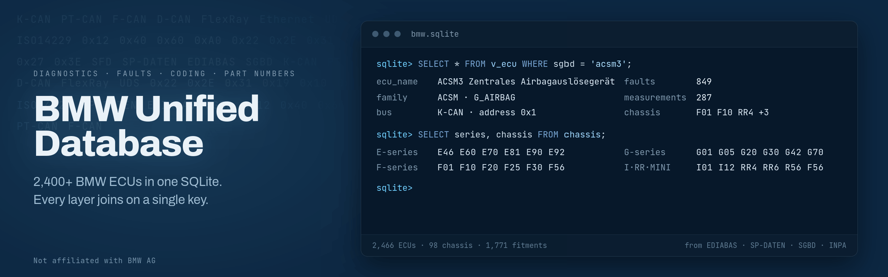
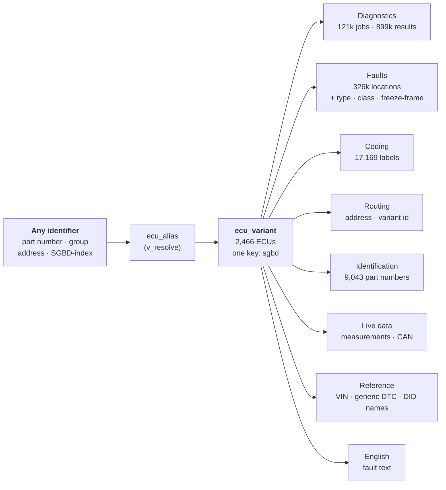

One SQLite database that aggregates every usable piece of BMW ECU data from a set of pinned open-source repositories into
one place, joined by a single ECU key.

## Safety

> [!CAUTION]
> Coding or flashing an ECU with data that is wrong for your exact car can disable or permanently damage
> the module, and some of these are airbag, brake, and steering controllers. Verify against an official
> source and a known-good backup before writing anything to a vehicle.

This is reference data, not a certified source, and not a substitute for current verified BMW data at the
moment you write to a car. The flash layer (`flash_map`) is identification only: every row is labelled
`usage = 'reference-only; do-not-flash'`, and nothing here performs a flash. Cars from roughly 2020 on
gate writes behind the SFD lock, which needs a BMW-signed token this database cannot produce.

## What's inside

2,466 BMW ECUs decoded from BMW's own diagnostic data, plus open reference layers, in 47 tables and 8
views (about 653 MB):

- **Diagnostics**: every diagnostic job, argument, and result per ECU, with the UDS service bytes.
- **Faults**: the full fault dictionary per ECU: location, type, class, and freeze-frame with
  raw-to-engineering scaling. German, with partial English.
- **Coding**: 17,169 chassis-wide coding labels (E-series), 2,674 F/G-series FDL coding labels, plus applied examples and raw coding images.
- **Routing**: the diagnostic address and variant id needed to reach each ECU.
- **Identification**: 9,043 hardware part numbers mapped to ECUs, and the engine codes that BMW's own ECU
  names mention, for 198 ECUs (search by `N54`, `M57TUE`, and so on).
- **Live data**: INPA measurements and OBDb signals; CAN messages, signals, and checksums.
- **Reference**: VIN decode, generic OBD2 codes, ISO 14229 standard DID names.

> [!TIP]
> Query the eight `v_*` views and the `ecu_alias` resolver, not the 47 base tables. The runnable queries
> are in [COOKBOOK.md](docs/COOKBOOK.md).

Coverage is uneven by layer, and the honest per-layer numbers are in [COVERAGE.md](docs/COVERAGE.md).
Every value reconciles to its source ([VERIFICATION.md](docs/VERIFICATION.md)).

## How it fits together

The join key for an ECU is `sgbd`, the lowercased SGBD name, and it is the same across every layer. Any
identifier, whether a part number, a routing group, a diagnostic address, an SGBD-index, or a family
name, resolves to that key first, and every layer hangs off it:



See [DATA-MODEL.md](docs/DATA-MODEL.md) for a worked example and how a fault resolves across `dtc`,
`dtc_type`, `dtc_class`, and `dtc_env`.

## What is in it

Full inventory of `dist/bmw.sqlite`, with a JSON mirror in `dist/json/`:

| Area | Tables | Rows |
|---|---|---|
| Diagnostics | ecu_variant, job, uds_service, job_arg, job_result, ecu_table, table_row | 3,083 ECUs, 121,615 jobs, 899,177 results, 86,492 tables, 2,066,853 table rows |
| Fault dictionaries | dtc, dtc_type, dtc_env, dtc_class | 326,161 locations, 42,415 types, 122,329 freeze-frame fields, 2,235 classes |
| English | english_dtc, english_job | 192,250, 358 |
| Routing | routing | 1,264 |
| Coding | coding_variant, coding_label, coding_example, coding_netto | 120,186 catalog labels, 4,651 + 11,957 examples, 530 raw images |
| Applicability | vehicle_ecu, option_code | 4,140, 15,662 |
| Identification and flash | ecu_hwnr, flash_map, ecu_engine | 9,043 part numbers, 619 flash records, 242 engine codes |
| Measurements | measurement | 7,291 |
| Live CAN | can_message, can_signal, can_value, can_checksum_algo | 337, 218, 100, 8 |
| Legacy DS2 | ds2_job, ds2_fault | 69, 347 |
| Translations | translation | 28,595 |
| External (own licenses, see [CREDITS.md](CREDITS.md)) | obd_signal, generic_dtc, vin_wmi, vin_position, uds_did_standard, fdl_code | 663 live signals, 3,071 generic codes, VIN decode, 58 standard DIDs, 2,674 F/G-series coding labels |
| Cross-layer and search | ecu_node, chassis, chassis_variant, ecu_group, ecu_family_dim, meta, search (FTS5) | graph + dimensions |
| Identity resolver | ecu_alias | 18,640 aliases (any identifier to an ECU) |
| Views | v_ecu, v_fault, v_coding, v_coding_all, v_did, v_measurement, v_vehicle_ecu, v_resolve | the everyday surface |

Of the 3,083 ECU records, 2,466 are fully decoded from source. The other 617 are stubs: an ECU that
appears in the routing, coding, flash, or measurement catalogs but has no decoded SGBD page. They carry
`is_stub = 1` and exist so that every reference resolves to a record.

## How to use it

The database uses SQLite. Node 22 reads it with no dependencies (`node --experimental-sqlite`). Any
SQLite client works too.

```js
import { DatabaseSync } from 'node:sqlite'
const db = new DatabaseSync('dist/bmw.sqlite')

// everything about one ECU
db.prepare('SELECT * FROM v_ecu WHERE sgbd = ?').get('acsm3')

// full-text search across faults, coding labels, jobs, options, measurements
db.prepare(`SELECT kind, key, text FROM search WHERE search MATCH 'Lambda' LIMIT 20`).all()
```

The runnable query cookbook is in [COOKBOOK.md](docs/COOKBOOK.md) and field-by-field column descriptions
are in [SCHEMA.md](docs/SCHEMA.md). A JSON mirror is in `dist/json/`: a flat `ecu-index.json`, one
`variants/<sgbd>.json` per ECU (3,083 files), and `index.json` with row counts and coverage.

## Get the database

The database is not in this repository. It is too large for git, and keeping it out also keeps the
BMW-derived data separate from the MIT tooling. Download the prebuilt `bmw.sqlite.gz` (about 130 MB) from
the [latest release](https://github.com/gediz/bmw-unified-db/releases/latest); the link always points at
the newest build:

```
curl -L -O https://github.com/gediz/bmw-unified-db/releases/latest/download/bmw.sqlite.gz
curl -L -O https://github.com/gediz/bmw-unified-db/releases/latest/download/SHA256SUMS
grep bmw.sqlite.gz SHA256SUMS | sha256sum -c    # verify the download
gunzip bmw.sqlite.gz                            # -> bmw.sqlite (653 MB)
```

To build it yourself instead (byte-identical to the release with Node v22.20.0), see [BUILD.md](docs/BUILD.md).

## Documentation

- [SCHEMA.md](docs/SCHEMA.md): every table, view, and column.
- [COOKBOOK.md](docs/COOKBOOK.md): runnable queries for the common tasks.
- [DATA-MODEL.md](docs/DATA-MODEL.md): how the layers join, with a worked example.
- [COVERAGE.md](docs/COVERAGE.md): what to trust and what is partial, per layer.
- [VERIFICATION.md](docs/VERIFICATION.md): how each layer was reconciled against its source.
- [BUILD.md](docs/BUILD.md): fetch the sources and build the database.
- [CREDITS.md](CREDITS.md): sources, attribution, and per-layer licensing.

## Provenance and licensing

Nothing here is invented. Each layer is extracted from a source repo and reconciles to it, and the
database carries its own provenance: the `data_source` table has one row per layer with its origin,
upstream, license, SPDX id, source file, and exact transformation.

- This project's own work (the parsers, schema, resolver, cross-links, and the compilation) is MIT.
- The BMW-derived layers (diagnostics, English, routing, coding, applicability, flash, measurements) come
  from BMW's EDIABAS, SP-DATEN, SGBD, and WinKFP data. That data is BMW copyrighted and is included here
  in decoded and restructured form for interoperability and right-to-repair. This project is not
  affiliated with BMW AG, and the affected data is removed on request.
- The external layers keep their own licenses. Three place obligations on the merged file: `obd_signal` is
  CC-BY-SA-4.0 (share-alike, attribute OBDb), the `vin_wmi` rows with `source = 'wikibooks'` are CC-BY-SA
  (share-alike, attribute Wikibooks), and `fdl_code` is GPL-3.0 (copyleft). Honor those for those layers if
  you redistribute `bmw.sqlite` whole.

[CREDITS.md](CREDITS.md) is the human-readable source and license map.
